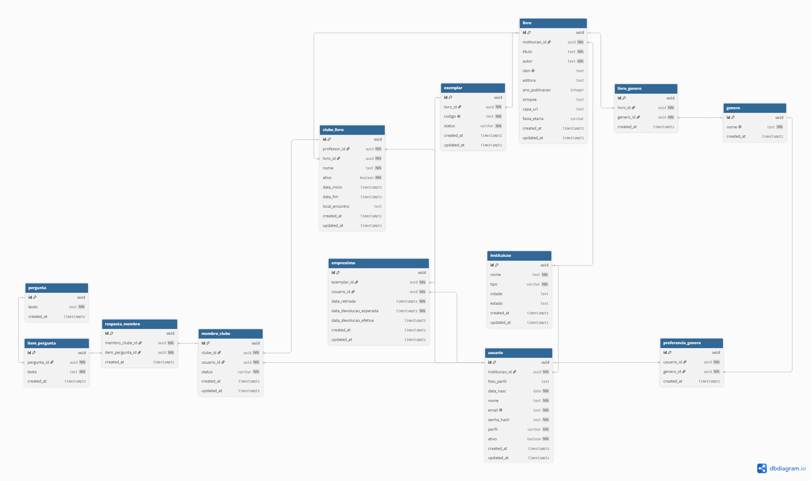

# SABER
Sistema de Acompanhamento Bibliográfico Escolar em Rede

## Estrutura do projeto
- `backend/` — NestJS
- `frontend/` — Angular
- `docs/` — Diagramas e documentação

## Convenção de commits

- feat:     nova funcionalidade
- fix:      correção de bug
- chore:    configuração, dependências
- docs:     documentação
- refactor: refatoração sem mudança de comportamento
- test:     testes

## Setup

### Pré-requisitos
- Node.js 20+
- Docker
- Git

### Backend

1. Instale as dependências:
```bash
   cd backend && npm install
```

2. Crie os arquivos de variáveis de ambiente com base no exemplo:
```bash
   cp backend/.env.example .env        # raiz (Docker)
   cp backend/.env.example backend/.env  # backend (NestJS)
```
   Preencha os valores em ambos os arquivos.

3. Suba o banco de dados:
```bash
   docker compose up -d
```

4. Rode as migrations:
```bash
   cd backend && npm run migration:run
```

5. Inicie o servidor:
```bash
   npm run start:dev
```

## Arquitetura

```
┌─────────────────────────────────────────────────────────────┐
│                        Cliente                              │
│                    Angular (SPA)                            │
│         Reactive Forms · HTTP Interceptor · Lazy Loading    │
└─────────────────────────┬───────────────────────────────────┘
                          │ HTTP/REST + JWT
┌─────────────────────────▼───────────────────────────────────┐
│                        Backend                              │
│                       NestJS                                │
│                                                             │
│  Controller → Service → Repository                          │
│                                                             │
│  JwtAuthGuard · RolesGuard · HttpExceptionFilter            │
└─────────────────────────┬───────────────────────────────────┘
                          │ TypeORM
┌─────────────────────────▼───────────────────────────────────┐
│                     Banco de Dados                          │
│                     PostgreSQL 16                           │
│              (container Docker em produção)                 │
└─────────────────────────────────────────────────────────────┘
```

## Comandos úteis

```bash
# Gerar uma nova migration
cd backend && npm run migration:generate -- src/database/migrations/nome-da-migration

# Aplicar migrations pendentes
cd backend && npm run migration:run

# Reverter a última migration
cd backend && npm run migration:revert

# Popular o banco com dados de desenvolvimento
cd backend && npm run seed

# Documentação da API (com o servidor rodando)
http://localhost:3000/api
```

## Decisões técnicas

**`synchronize: false`**
O TypeORM nunca altera o schema do banco automaticamente. Toda mudança estrutural é feita via migration versionada, garantindo rastreabilidade e consistência entre ambientes.

**UUID como chave primária**
Todas as entidades usam UUID gerado pelo banco (`uuid_generate_v4()`). Evita colisões em ambientes distribuídos e não expõe sequências numéricas previsíveis nas URLs.

**`timestamptz` para campos de data e hora**
Todos os campos de data com hora usam `TIMESTAMP WITH TIME ZONE`. Garante que os valores são armazenados em UTC e convertidos corretamente para o fuso do cliente, evitando bugs silenciosos de timezone.

**Senhas com bcrypt**
Senhas nunca são armazenadas em texto puro. O hash é gerado com `bcrypt` (salt de 10 rounds) antes de persistir. O campo na entity se chama `senha_hash` para deixar explícita a intenção.

**Filtro por instituição via JWT**
O payload do token JWT inclui o `instituicao_id` do usuário autenticado. Os endpoints `findAll` usam esse valor para filtrar os dados, garantindo isolamento entre instituições sem consultas adicionais ao banco.

**Quantidade de exemplares calculada em runtime**
Não existe campo `quantidade_disponivel` na tabela `livro`. A disponibilidade é calculada em tempo real contando exemplares com `status = 'disponivel'`. Evita dados derivados desatualizados e inconsistências entre o campo e o estado real.

**Validação em duas camadas**
Toda entrada de usuário é validada no frontend (Angular Reactive Forms) e novamente no backend (class-validator nos DTOs). A validação no frontend é UX; a do backend é segurança.

## Diagrama Entidade-Relacionamento

